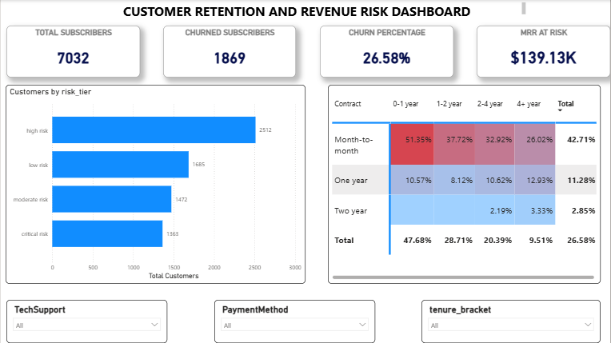

# Customer Churn & Revenue Risk Analytics

Tools: MySQL, Power BI, Advanced DAX, Excel | Personal Project | 2026

## Overview
An end-to-end churn and revenue-risk analysis pipeline, identifying which customer segments are most likely to churn and how much recurring revenue is at risk — built for targeted retention decision-making.

## What Was Done
- Engineered an end-to-end data pipeline in MySQL and Excel across 7,032 customer records, applying multi-condition CASE logic to construct 4 automated churn risk tiers and tenure cohorts
- Deployed an interactive Power BI dashboard using custom DAX measures to track critical business KPIs
- Built dynamic cohort matrix heatmaps across support and billing dimensions to surface where churn concentrates

## Dashboard

## Key Findings
- Overall churn rate: 26.58%
- $139.13K in Monthly Recurring Revenue (MRR) at risk
- 51.55% of churn concentrated among early-tenure (<1 year) customers on month-to-month contracts — a clear target for retention campaigns

## Files
- Cleaned Excel dataset
- SQL script (churn risk tier & cohort logic)
- Power BI dashboard (.pbix)
