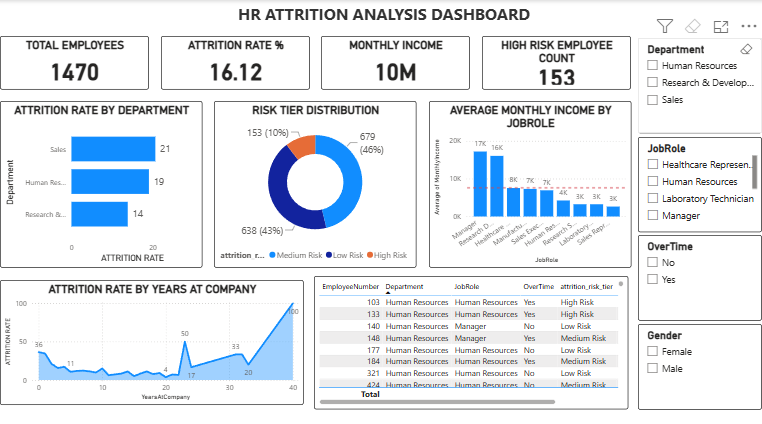

# HR Employee Attrition Analysis

An end-to-end data analysis project exploring employee attrition patterns using the IBM HR Employee Attrition dataset, combining Excel, Python, SQL, Power BI, and a Generative AI Q&A feature.

## Project Summary

The HR attrition data indicates a significant employee-retention challenge, with an overall attrition rate of 16.12% across 1,470 employees. Attrition varies considerably by department, with Sales recording the highest rate at 21%, followed by Human Resources at 19% and Research & Development at 14%. A particularly important concern is overtime: employees who work overtime have a 30.5% attrition rate, compared with only 10.4% among employees who do not work overtime, suggesting that workload and work-life balance may be associated with higher turnover.

The Sales Representative role shows the highest attrition rate at 39.8%, making it a key area for further investigation. In addition, 153 employees (10%) are classified as high risk, while 638 (43%) fall into the medium-risk category, indicating that a substantial proportion of employees may require attention.

Recommendation: HR should prioritize retention efforts in high-attrition roles and departments, particularly Sales Representatives. A targeted review of overtime, workload, compensation, career growth, and employee satisfaction could help identify the main drivers of turnover and support focused retention initiatives.

## Tools Used
- Excel — data cleaning
- Python (Pandas) — exploratory data analysis
- SQL (MySQL) — querying, window functions, risk-tier view
- Power BI — interactive dashboard
- Generative AI (Gemini) — natural language Q&A over the dataset

## Dashboard

The dashboard includes KPI cards (Total Employees, Attrition Rate, Avg Monthly Income, High Risk Count), attrition breakdowns by department and job role, a risk-tier distribution, and interactive slicers (Department, Job Role, OverTime, Gender).

## Generative AI Feature

A Python function was built to answer natural-language HR questions (e.g. *"Which job role has the highest attrition?"*) using live dataset statistics as context for an LLM, returning grounded answers rather than generic text.

## Key Findings
- Overall attrition rate: 16.12%
- Highest-attrition department: Sales (21%)
- Overtime employees attrite at 30.5% vs 10.4% for non-overtime
- Highest-attrition role: Sales Representative (39.8%)
- 10% of employees classified high risk, 43% medium risk

## Files
- hr_attrition_cleaned.xlsx — cleaned dataset
- hr_attrition_queries.sql — SQL analysis and risk-tier view
- HR_Attrition_EDA.ipynb — Python cleaning & exploratory analysis
- GenAI_Attrition.ipynb — Generative AI Q&A feature
- HR_Attrition_Dashboard.pbix — Power BI dashboard file
